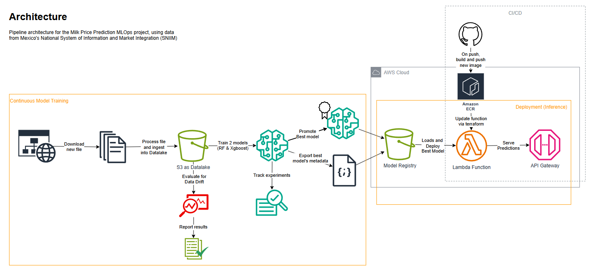
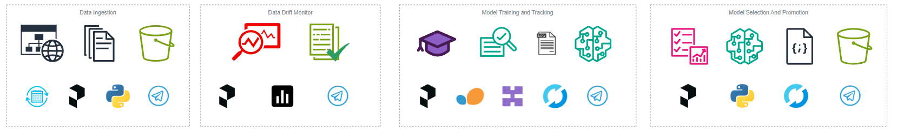

# Milk Price Prediction in Mexico 
## MLOps Zoomcamp Capstone

<p align="center">
  
</p>

<p align="center">
  <!-- Development & ML -->
  
  
  
  
  
  
  
  <!-- Orchestration & Monitoring -->
  
  
  
  

  <!-- Cloud & Deployment -->
  
  
  
  
  
</p>

Rubric [checklist](https://github.com/Maxkaizo/milk_price_prediction/tree/main?tab=readme-ov-file#rubric-checklist) for peer review
---

## Project Overview
This project delivers a complete MLOps pipeline to forecast the daily price of milk in Mexico. It is designed as a production-ready, automated system capable of managing the entire machine learning lifecycle with minimal human intervention.
The core purpose is to move beyond a static model and implement a dynamic solution that automatically adapts to new data. The system achieves this by:
- **Training and versioning models** continuously.
- **Deploying the best model** to a production-ready API.
- **Monitoring** for data drift to ensure prediction quality.
- Automatically **promoting a better-performing model** when available.
- The expected outcome is **a reliable, self-maintaining prediction service** that consistently delivers accurate forecasts, ensuring the most effective model is always active.

---

## Business Context

This project provides a practical forecasting tool for the Mexican milk industry, built on a foundation of reliable, official data.

- **Data Source:** The model is trained using data from Mexico's National System of Information and Market Integration (SNIIM). While the official source updates on Mondays, Wednesdays, and Fridays, our system includes an automated script that checks for new data daily, ensuring our model can always be trained on the most current information available.

- **Business Value:** The system empowers stakeholders—such as producers, distributors, and analysts—to make informed, data-driven decisions. By providing reliable price forecasts, it can help with strategic planning, resource management, and risk mitigation.

- **Deliverables:** The project delivers value through two distinct channels:
      1. An On-Demand Cloud API: A deployed endpoint for real-time price predictions that can be integrated into any application.
      2. A Daily Price Report: A scheduled batch process, orchestrated with Prefect, runs daily to generate and publish a report of suggested prices, providing proactive insights directly to users.

---

## MLOps Context: A Three-Layer Design

Instead of a single, monolithic process, our MLOps approach is designed with a modular, three-layer architecture. This separation of concerns makes the system more robust, scalable, and easier to maintain. This design philosophy sets the stage for the detailed architecture.

- **The Training Layer:** This is a periodic pipeline responsible for creating and versioning our predictive models. It triggers automatically on code or data changes, handling everything from data validation and processing to model training and evaluation. Its main goal is to produce a reliable, version-controlled model candidate.

- **The Inference Layer:** This layer is responsible for delivering predictions to the end-user and operates in two modes:
      1. Online Inference: A cloud-deployed API provides real-time, on-demand predictions.
      2. Batch Inference: A scheduled local process runs daily to generate reports with future price forecasts.

- **The Monitoring Layer:** This is the intelligence of our system. It continuously oversees the entire process, tracking data quality and model performance. It is responsible for detecting issues like data drift and, most importantly, for automatically promoting the best-performing model to production, thus closing the MLOps loop.

---

## Architecture

<p align="center">
  
</p>}

### Data Preparation - Simulating a Datalake

This layer performs the crucial one-time "bootstrapping" of our data lake. Since the official government data is a single, non-tabular Excel file, it's unsuitable for direct use in a daily pipeline. Our simulate_publication script is executed once to solve this: it processes the entire historical file, converts it into a clean, tabular structure, and partitions the data into daily files stored in AWS S3. This initial setup establishes the structured data lake that the day-to-day training pipelines will interact with, allowing them to simply focus on updating the current day's information.

**Tool Summary:**

| Tool | Role in this Layer |
| :--- | :--- |
| **pandas** | Handles the core logic of reading, cleaning, and restructuring the raw data. |
| **openpyxl** | Enables the initial ingestion of data from the source `.xlsx` file. |
| **AWS S3** | Serves as the data lake where the clean, partitioned data is stored. |
| **boto3 / s3fs** | Provides the Python interface to write the processed files to S3. |

### Development & Training Layer

This is where our models are born and refined. The process begins by fetching the latest prepared data from the S3 data lake. We employ powerful libraries like **scikit-learn** and **XGBoost** to build our predictive models. To ensure peak performance, we automate the search for the best model configuration using **Hyperopt** for hyperparameter tuning. The entire journey, from data ingestion to model evaluation, is orchestrated as a seamless, repeatable pipeline by **Prefect**. Crucially, every experiment's parameters and metrics are logged with **MLflow**, which also serves as our Model Registry to version and store the final model candidates. To maintain code quality, we use **Black** for automated code formatting.

<p align="center">
  
</p>

**Training Flow Breakdown**
The training pipeline, orchestrated by Prefect, follows these sequential steps:

1. Load Data: The flow starts by fetching the latest clean and prepared data from the AWS S3 data lake.

2. Train Models: Two separate models, a Random Forest (scikit-learn) and an XGBoost model, are trained on this data. This allows us to compare their performance.

3. Optimize Hyperparameters: For each model type, Hyperopt is used to run multiple trials and find the optimal set of hyperparameters, maximizing a target metric like accuracy or minimizing error.

4. Log Experiments to MLflow: Every training run, including all its parameters, metrics, and model artifacts, is logged as an experiment in MLflow. This creates a complete and auditable record of our work.

5. Evaluate and Select Best Model: The pipeline compares the performance of the best Random Forest model against the best XGBoost model.

6. Register Winning Model: The model with the superior performance is formally registered in the MLflow Model Registry, versioned, and tagged as a candidate for production.

**Tool Summary:**

| Tool | Role in this Layer |
| :--- | :--- |
| **Prefect** | Orchestrates the end-to-end training and evaluation pipeline. |
| **MLflow** | Tracks experiments and manages models in the Model Registry. |
| **scikit-learn / XGBoost** | Core libraries for model training and evaluation. |
| **Hyperopt** | Automates hyperparameter optimization to find the best model. |
| **Black** | Enforces consistent, clean code formatting across the project. |
| **dotenv** | Securely manages credentials and environment variables. |

### Inference & Deployment Layer

Once a model is approved, this layer makes it accessible. The entire cloud infrastructure—including the API Gateway, Lambda functions, and ECR repositories—is managed declaratively using **Terraform**, enabling Infrastructure as a Code (IaC) for consistency and reproducibility. This layer operates in two modes:
1.  **Online Inference:** We use **Flask** and **Gunicorn** to build a robust API, which is containerized with **Docker** and stored in **AWS ECR**. This API is then deployed, often using **AWS Lambda**, and exposed to the world via **AWS API Gateway**.
2.  **Batch Inference:** A separate **Prefect** flow runs on a daily schedule to generate a "Suggested Prices Report". This batch job uses the latest model to make predictions and delivers proactive insights.

**Tool Summary:**

| Tool | Role in this Layer |
| :--- | :--- |
| **Terraform** | Manages and provisions all AWS infrastructure as code (IaC). |
| **Docker** | Containerizes the application for consistent, portable deployment. |
| **Flask / Gunicorn** | Builds and serves the production-ready prediction API. |
| **Prefect** | Orchestrates the scheduled batch inference pipeline for daily reports. |
| **AWS ECR / S3 / Lambda / API Gateway** | The core AWS services for storing artifacts and serving the model. |
| **boto3** | Provides the Python interface to interact with AWS services. |

### Monitoring & Alerting Layer

A deployed model requires constant supervision. This layer acts as the system's watchdog. We use **Evidently AI** to continuously monitor the live model, generating reports that detect data drift and performance degradation. These reports often include visualizations created with **Matplotlib** and **Seaborn**. If a significant event occurs—such as a drop in accuracy or the detection of data drift—the system automatically triggers an alert. These notifications are sent instantly to the team via a **Telegram** bot, enabling a proactive approach to model maintenance.

**Tool Summary:**

| Tool | Role in this Layer |
| :--- | :--- |
| **Evidently AI** | Actively monitors for data drift and model performance issues. |
| **Telegram** | Serves as the notification channel for automated system alerts. |
| **Matplotlib / Seaborn** | Creates visualizations for data analysis and monitoring reports. |

---

### **Repository Structure**

The project is organized into a modular structure where each directory has a clear and specific responsibility. This separation of concerns is key to maintaining a clean, scalable, and manageable MLOps project.

```
.
├── orchestration/       # Core logic for all Prefect pipelines (training, batch inference).
├── iac/               # Infrastructure as Code (Terraform) for AWS.
├── deployment/        # Files for deploying the model (Dockerfiles, local tests, API code).
├── simulate_publication/ # One-time scripts to build the initial data lake.
├── data/              # Local representation of the data lake and processed data.
├── monitor/           # Output reports from Evidently AI (data/model drift).
├── reports/           # Business-facing output, like daily prediction CSVs.
├── best_practices/    # Reports and logs for code quality checks (e.g., Black).
├── mlflow/            # Local configuration and database for the MLflow server.
├── Pipfile & Pipfile.lock # Project dependencies managed by Pipenv.
└── README.MD          # This documentation file.
```

---

#### Folder Descriptions

*   **orchestration**: The heart of the project's automation.
    *   `flows/`: Contains the main Prefect flow definitions. These files define the high-level sequence of operations, like `master_daily_flow.py` which runs the daily training and monitoring, or `daily_predictions_flow.py` for batch inference.
    *   `tasks/`: Holds the individual, reusable units of work (Prefect tasks) that are assembled into flows. This includes tasks for training models (`train_model.py`), monitoring drift (`monitor_data_drift.py`), and sending alerts (`notify_telegram.py`).

*   **iac (Infrastructure as Code)**: This directory contains all the Terraform code to create, manage, and provision the required AWS cloud infrastructure.
    *   `modules/`: Reusable Terraform modules for creating specific resources like an ECR repository, a Lambda function, or an API Gateway. This makes the infrastructure code modular and easy to read.
    *   `envs/`: Environment-specific variable files (e.g., `prod.tfvars`) to customize deployments for different environments like staging or production.

*   **deployment**: Contains everything needed to serve the model.
    *   `ondemand/`: Specific files for the serverless on-demand API, including the `Dockerfile.lambda`, the application code (`app.py`), and the Lambda handler (`handler.py`).
    *   `local/`: Scripts and Dockerfiles for testing the prediction service on a local machine before deploying to the cloud.

*   **simulate_publication**: Holds the critical one-time scripts used to bootstrap the project. These scripts read the complex, non-tabular source Excel file and transform it into a clean, partitioned data lake in S3, simulating a real-world data source.

*   **data**: Represents the local data assets.
    *   `raw/`: The original, untouched source data file.
    *   `datalake/`: A local mirror of the S3 data lake structure (`year/month/day`), useful for local development and testing without needing to constantly query the cloud.
    *   `processed/`: Contains aggregated or processed datasets, like the `full_dataset.parquet` used for training.

*   **monitor**: This directory acts as an archive for the output generated by the monitoring layer. It stores the HTML reports from **Evidently AI**, providing a historical record of data drift and model performance over time.

*   **reports**: This is where the final business-facing outputs are stored. For this project, it contains the CSV files with the daily price predictions generated by the batch inference pipeline.

*   **best_practices**: Contains logs and reports related to code quality and formatting. The text files here are outputs from tools like **Black**, showing which files were checked and formatted, ensuring code consistency across the project.

*   **mlflow**: Configuration files for running a local MLflow tracking server, including the SQLite database (`mlflow.db`) that stores experiment metadata.

*   **Pipfile / Pipfile.lock**: These files define the Python dependencies of the project, managed using `pipenv` to ensure reproducible environments.

---

### Reproducibility

You can find a Makefile in the root folder of the repo and the detailed instructions and walkthrough in [reproducibility/](https://github.com/Maxkaizo/milk_price_prediction/tree/main/reproducibility) folder

---

### Rubric Checklist

This project act as capstone project for the DataTalksClub MLOps Zoomcamp, and in order to make it easy for the peers that will check this repo, here's a checklist to match with the rubric

- [ ] Problem description
    - On top of this [README](https://github.com/Maxkaizo/milk_price_prediction/blob/main/README.MD) file
- [ ] Cloud
    - The configuration files to deploy via terraform are located in [iac/](https://github.com/Maxkaizo/milk_price_prediction/tree/main/iac) folder
    - Instructions to test can ve found in [reproducibility/instructions.md](https://github.com/Maxkaizo/milk_price_prediction/blob/main/reproducibility/instructions.md#deploy-infra-on-aws-via-terraform) 
    - or simply use this command to test the cloud 
```bash
curl -XPOST "https://1d4oza8gnd.execute-api.us-east-1.amazonaws.com/default/predict" -H "Content-Type: application/json" -d '{
    "Estado": "Jalisco",
    "Ciudad": "Guadalajara",
    "Tipo": "Pasteurizada",
    "Canal": "Autoservicio",
    "día": 1,
    "mes": 8,
    "año": 2025,
    "dia_semana": "4",
    "Precio_lag1": 23.5,
    "Precio_mean7": 23.1
}'
```
- [ ] Experiment tracking and model registry
    - I've used Mlflow and prefect, so all the Mlflow configuration can be found within the scripts that run the tasks under [orchestration/tasks](https://github.com/Maxkaizo/milk_price_prediction/tree/main/orchestration/tasks)
    - For example this one, where I trained the [Xgboost model](https://github.com/Maxkaizo/milk_price_prediction/blob/main/orchestration/tasks/train_xgboost_model.py) 
    - Screenshots are located in [walkthrough](https://github.com/Maxkaizo/milk_price_prediction/blob/main/reproducibility/walkthrough.md)
    - And if you clone the repo, instructions are located in [reproducibility/instructions.md] (https://github.com/Maxkaizo/milk_price_prediction/blob/main/reproducibility/instructions.md#deploy-and-run-prefect-flows)    
    - Also the registered model screenshot can be located in this section of the [walkthrough](https://github.com/Maxkaizo/milk_price_prediction/blob/main/reproducibility/walkthrough.md#main-training-daily-flow)
- [ ] Workflow orchestration
    - Used Prefect
    - Checkout [orchestration/](https://github.com/Maxkaizo/milk_price_prediction/tree/main/orchestration)
    - Screenshots are located in [walkthrough](https://github.com/Maxkaizo/milk_price_prediction/blob/main/reproducibility/walkthrough.md)
- [ ] Model deployment
    - The task for a daily batch prediction can be found [here](https://github.com/Maxkaizo/milk_price_prediction/blob/main/orchestration/tasks/generate_daily_predictions.py)
    - Some batch [reports](https://github.com/Maxkaizo/milk_price_prediction/tree/main/reports) examples
    - Checkout this [README](https://github.com/Maxkaizo/milk_price_prediction/blob/main/deployment/notes/README.MD) for local and a hardcoded version deployed on the cloud, all config files are under [deployment/ondemand](https://github.com/Maxkaizo/milk_price_prediction/tree/main/deployment/ondemand)
    - Also the best deployment is the onde made with terraform with dinamic definition, showed in the [walkthrough](https://github.com/Maxkaizo/milk_price_prediction/blob/main/reproducibility/walkthrough.md#main-training-daily-flow) 
- [ ] Model monitoring
    - Used Evidently for monitoring data drift and model performance, and the configuration is in [orchestration/tasks/monitor_data_drift_from_s3.py](https://github.com/Maxkaizo/milk_price_prediction/blob/main/orchestration/tasks/monitor_data_drift_from_s3.py) and [orchestration/tasks/monitor_model_drift.py](https://github.com/Maxkaizo/milk_price_prediction/blob/main/orchestration/tasks/monitor_model_drift.py)
    - Also you can find some Telegram notifications in [walkthrough](https://github.com/Maxkaizo/milk_price_prediction/blob/main/reproducibility/walkthrough.md)
    - There's also some report examples in [monitors/reports](https://github.com/Maxkaizo/milk_price_prediction/tree/main/monitor/reports)
- [ ] Reproducibility
    - Checkout the [instructions](https://github.com/Maxkaizo/milk_price_prediction/blob/main/reproducibility/instructions.md)
- [ ] Best practices
  - [ ] There are unit tests
        - Check out the testing [log](https://github.com/Maxkaizo/milk_price_prediction/blob/main/tests/log.md)
  - [ ] There is an integration test
        - Check out the testing [log](https://github.com/Maxkaizo/milk_price_prediction/blob/main/tests/log.md)
  - [ ] Linter and/or code formatter are used
        - Used Black, checkout [best_practices/code_format](https://github.com/Maxkaizo/milk_price_prediction/tree/main/best_practices/code_format)
  - [ ] There's a Makefile
        - [Makefile](https://github.com/Maxkaizo/milk_price_prediction/blob/main/Makefile) Located in the root folder  and referenced in the [instructions.md](https://github.com/Maxkaizo/milk_price_prediction/blob/main/reproducibility/instructions.md)
  - [ ] There are pre-commit hooks 
        - checkout [best_practices/pre_commit](https://github.com/Maxkaizo/milk_price_prediction/blob/main/best_practices/pre_commit/README.MD)
  - [ ] There's a CI/CD pipeline
        - checkout [best_practices/ci_cd](https://github.com/Maxkaizo/milk_price_prediction/blob/main/best_practices/ci_cd/READE.MD)


---