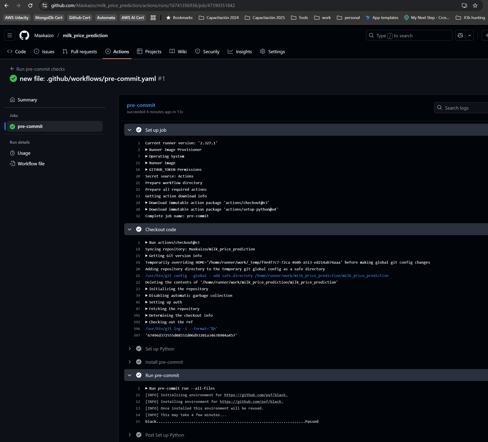
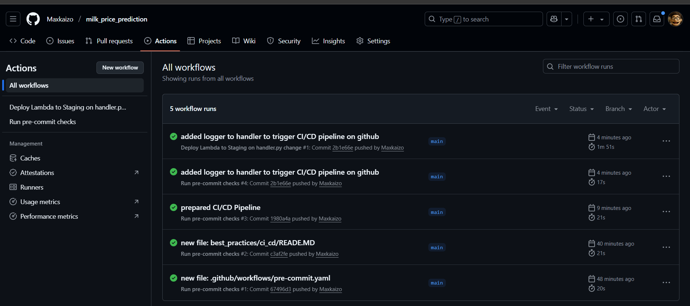
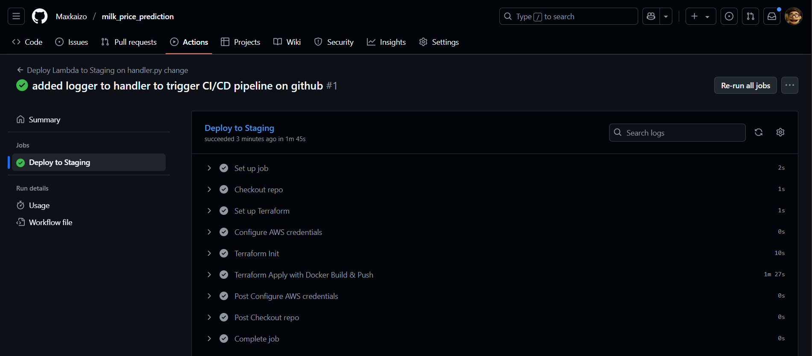
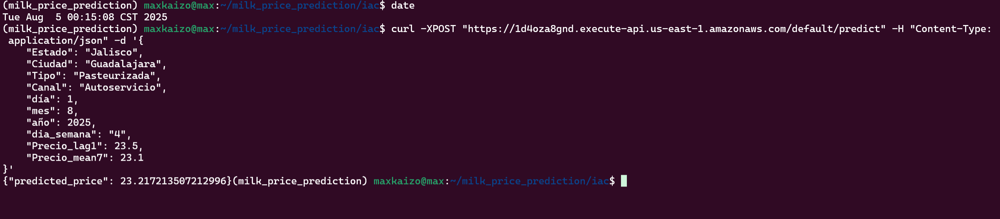

I'm enabling 2 scenarios

* In the first one, I only make code formatting test associated with a github action

Config:

```yaml
name: Run pre-commit checks

on:
  pull_request:
  push:
    branches: [main]

jobs:
  pre-commit:
    runs-on: ubuntu-latest

    steps:
      - name: Checkout code
        uses: actions/checkout@v3

      - name: Set up Python
        uses: actions/setup-python@v4
        with:
          python-version: "3.12"

      - name: Install pre-commit
        run: |
          pip install pre-commit

      - name: Run pre-commit
        run: |
          pre-commit run --all-files
```

Result:



---

* And in the second one, I've defined a flow that deploys a new docker image to my lambda function into the staging environment if a new version of the handler.py file is pushed

The steps are:

1. A new version of iac/code/handler.py is uploaded
2. Github actions detect the push and start an action
3. Terraform code at iac/main.tf is initiated ( using iac/envs/staging.tfvars), planned and applied automaticaly


config:

```yaml
name: Deploy Lambda to Staging on handler.py change

on:
  push:
    paths:
      - 'iac/code/handler.py'

jobs:
  deploy:
    name: Deploy to Staging
    runs-on: ubuntu-latest

    steps:
      - name: Checkout repo
        uses: actions/checkout@v3

      - name: Set up Terraform
        uses: hashicorp/setup-terraform@v3
        with:
          terraform_version: 1.5.7

      - name: Configure AWS credentials
        uses: aws-actions/configure-aws-credentials@v3
        with:
          aws-access-key-id: ${{ secrets.AWS_ACCESS_KEY_ID }}
          aws-secret-access-key: ${{ secrets.AWS_SECRET_ACCESS_KEY }}
          aws-region: us-east-1

      - name: Terraform Init
        working-directory: iac
        run: terraform init

      - name: Terraform Apply with Docker Build & Push
        working-directory: iac
        run: terraform apply -auto-approve -var-file="envs/staging.tfvars"

```

Result:

Checkout the resultin report here:

https://github.com/Maxkaizo/milk_price_prediction/actions/runs/16742043473/job/47392257866


Alse here are a few screenshots






and a test to the service




