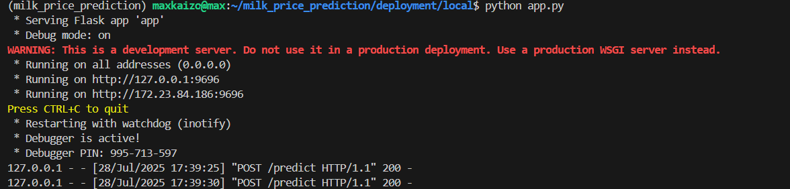
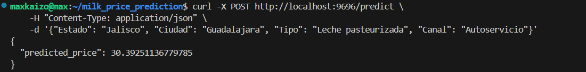
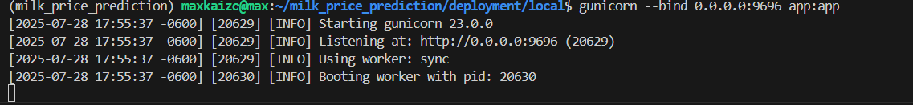
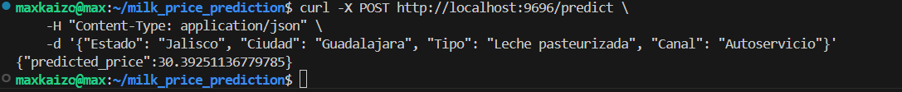
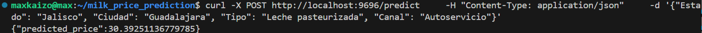
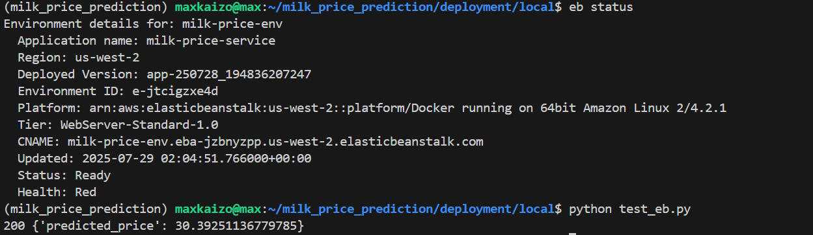
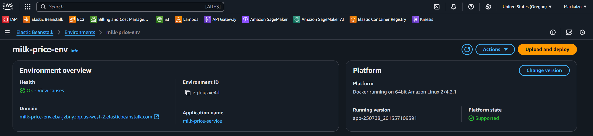

# Roadmap

## Entirely local

- Use a previously trained model, stored locally
- Run a Flask Server
- predict using curl

## Entirely local + gunicorn

- Switched to gunicorn

## Local with Docker container + gunicorn

- Built container

## Cloud deployment using Elastic Beanstalk (sith Docker image)

- Deployed with AWS eb cli

