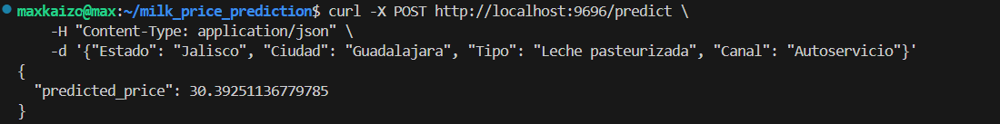
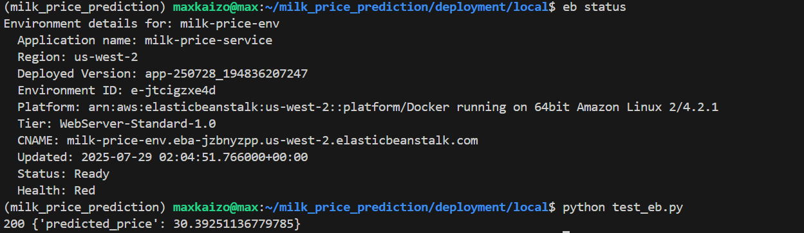
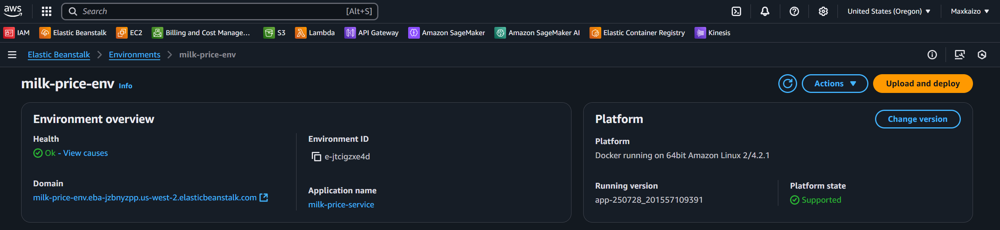

# Roadmap:

* Entirely Local. Local files + Flask
* Entirely Local + gunicorn
* Local with Docker container + gunicorn
* Cloud deployment using Elastic Beanstalk (with Docker image)
* Cloud deployment in steaming mode. Using Lambda + Kinesis --- configurar manualmente la lambda
* Cloud deployment in steaming mode. Using Lambda + Kinesis + ECR --- crear la lambda a partir de un contenedor docker, a partir de aqui ya descargaremos el modelo del bucket de s3 mas reciente 
* Cloud deployment in steaming mode. Using Lambda + Kinesis + ECR + Terraform, managed via Terraform

# Completed:

## Entirely local

- Use a previously trained model, stored locally
- Run a Flask Server
- predict using curl

## Entirely local + gunicorn

- Switched to gunicorn

## Local with Docker container + gunicorn

- Built container

## Cloud deployment using Elastic Beanstalk (with Docker image)

- Deployed with AWS eb cli

