# MLOps Project - Milk Price Prediction
## Walkthrough

### Start MlFlow Server

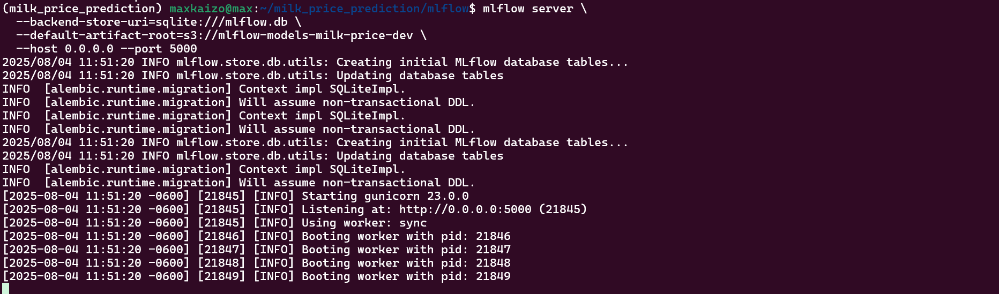

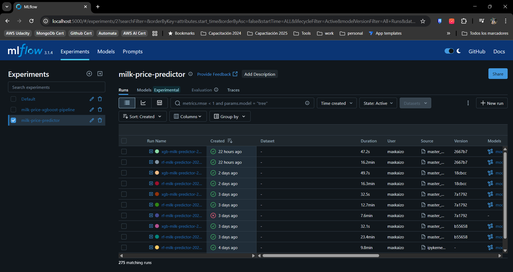

### Start Prefect Server

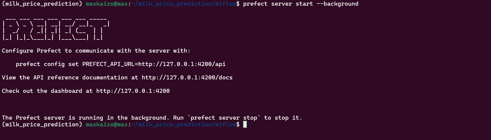

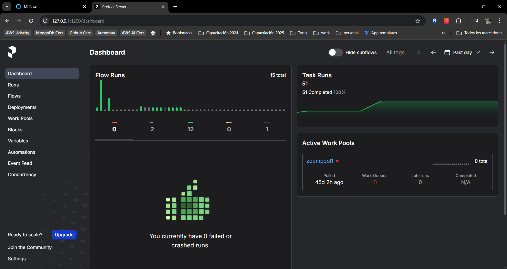

### Main Training Daily Flow 

* Deployment

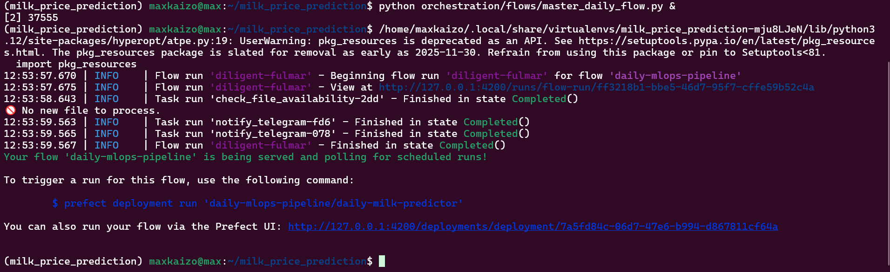

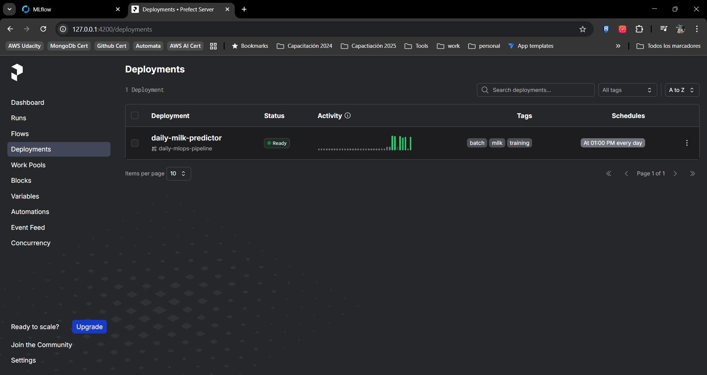

* Runs

- With no new file

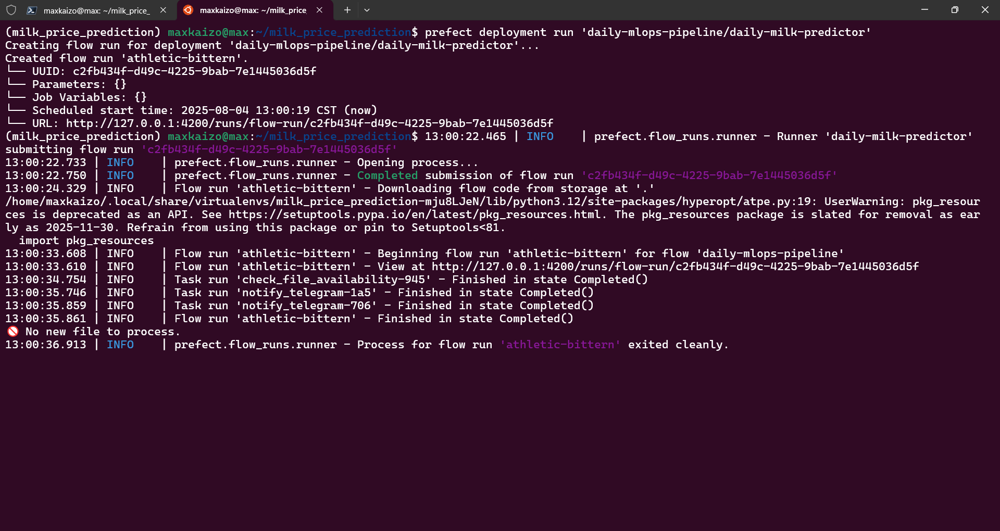

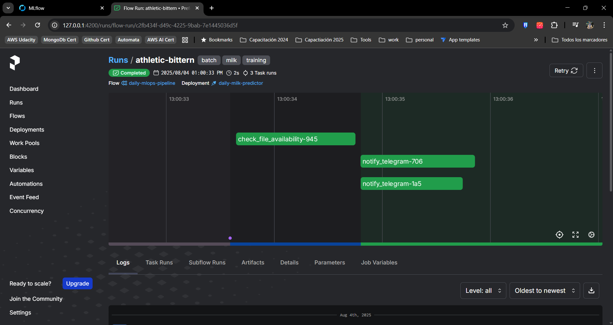

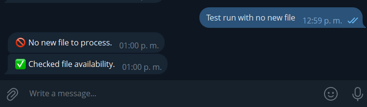

- With new files

* The training pipeline runs completely
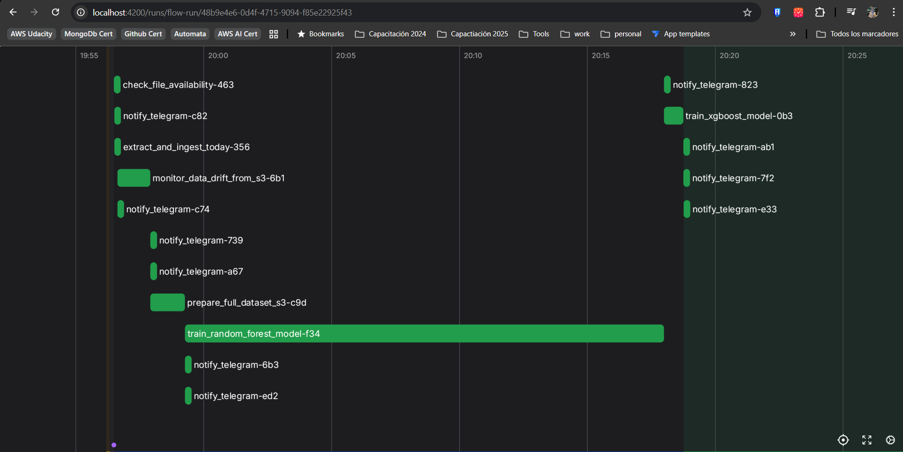
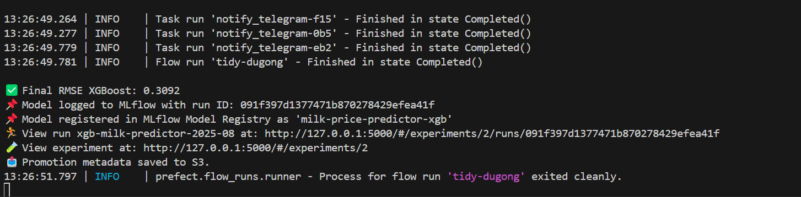

* Anew file is ingested to datalake
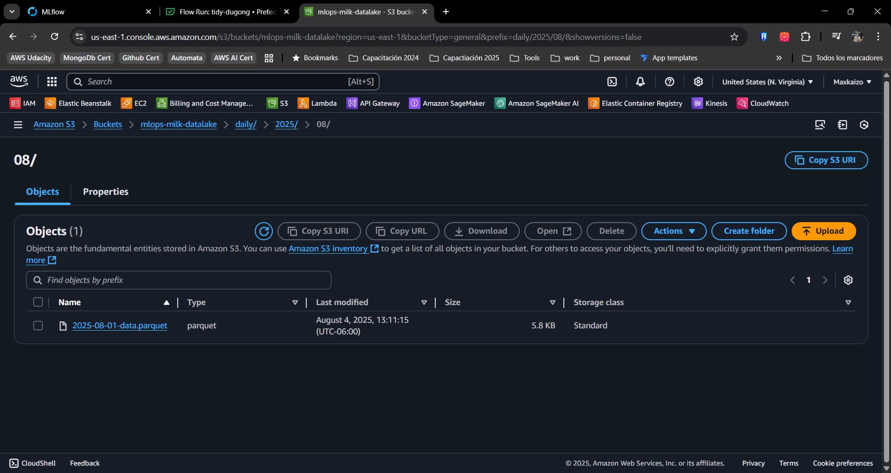

* A new model is trained on the most up-to-date data available.
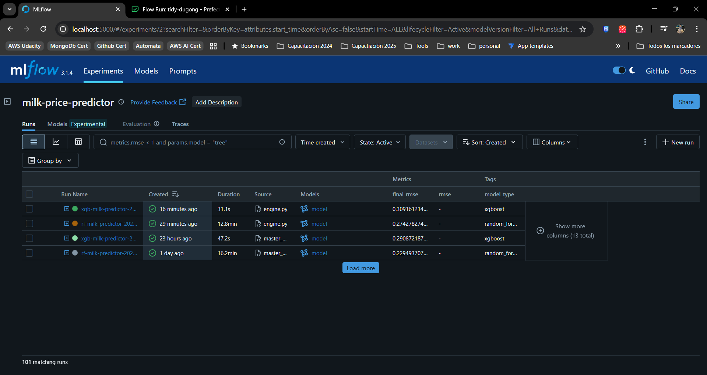

* A data drift report is generated by Evidently AI, ensuring data quality is continuously monitored. (located at monitor/reports/)
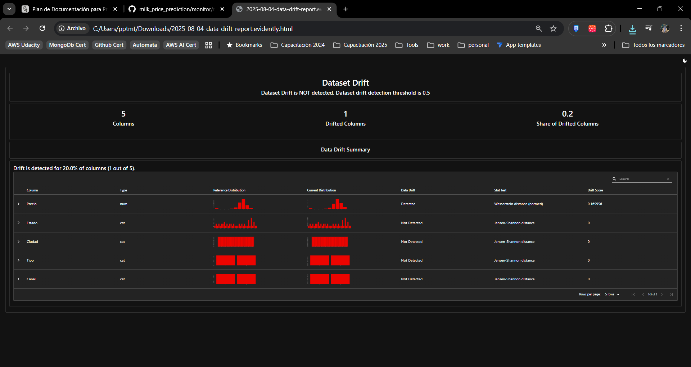

* The best-performing model (between Random Forest and XGBoost) is identified and promoted to the "Staging" stage in the MLflow Model Registry.
* A metadata file in S3 is updated, pointing to the new best model, making it instantly available for inference services.
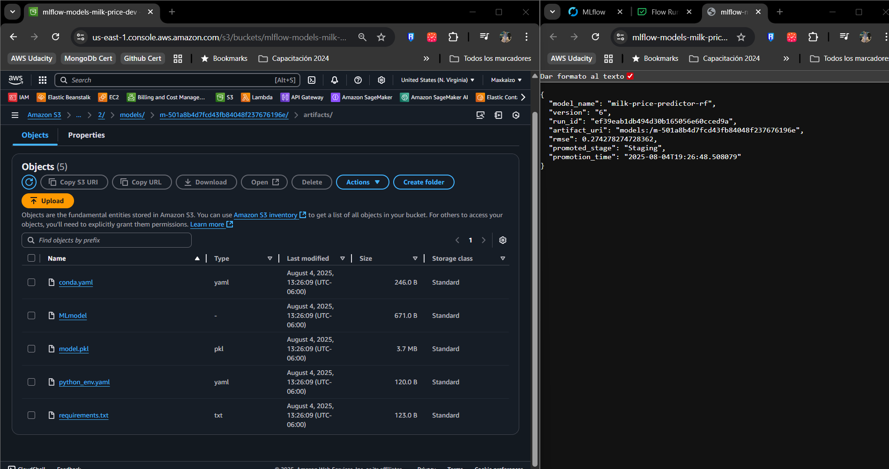

* A full set of notifications is sent to Telegram, providing a complete audit trail of the run.
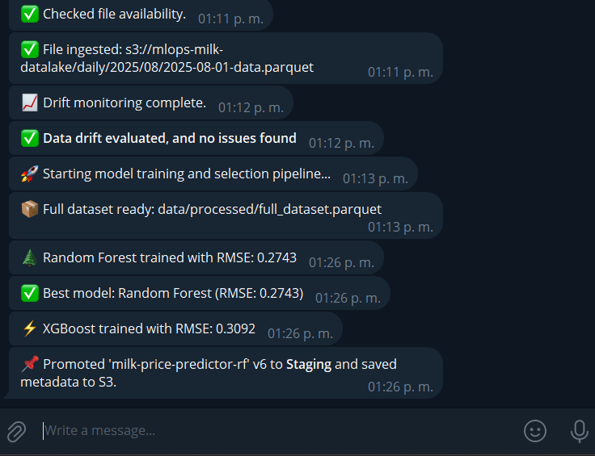

### Batch Prediction Daily Flow 

* Deployment
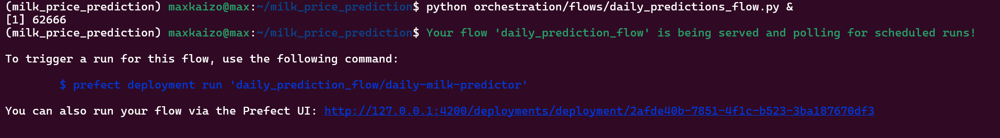

* Run
- The training pipeline runs completely

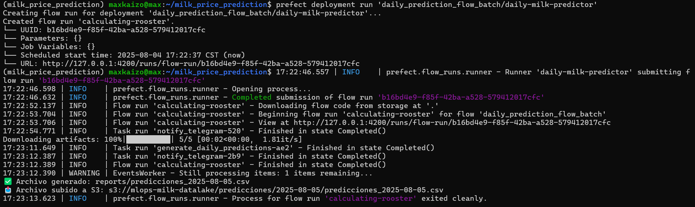

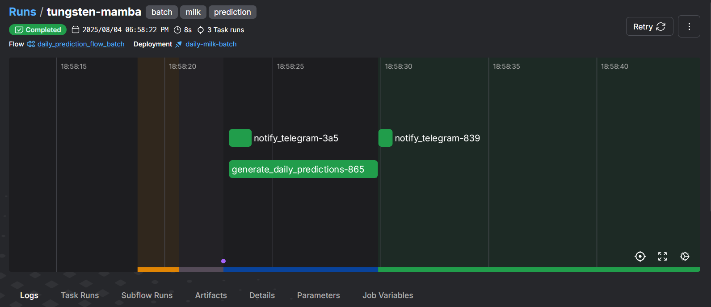

* A full set of notifications is sent to Telegram, providing a complete audit trail of the run.
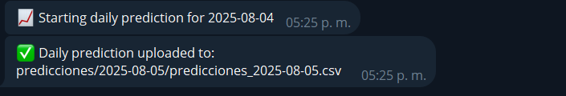

- A full set of predictions is created and stored at reports/

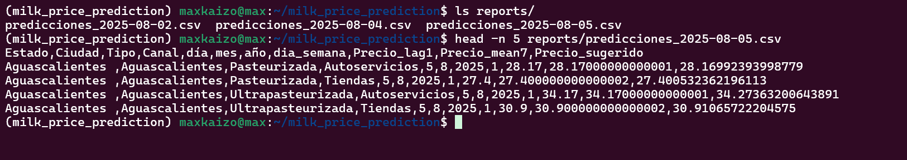

### Deploy infra via Terraform

* deployment

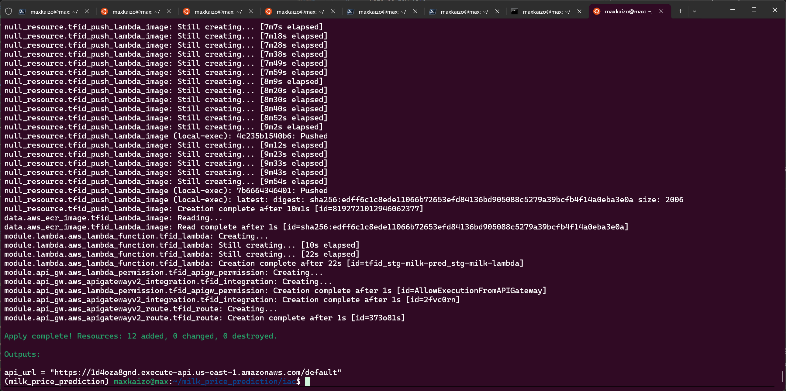

* List Resources
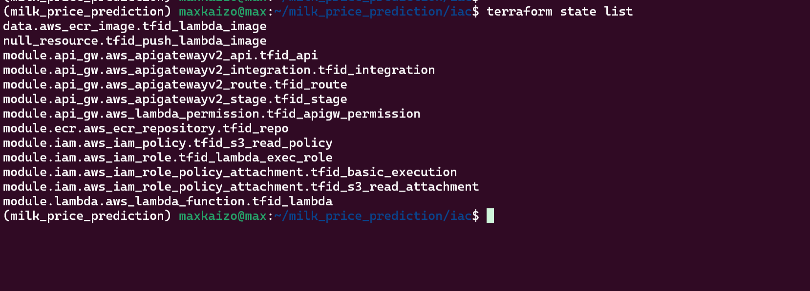

* Test service

